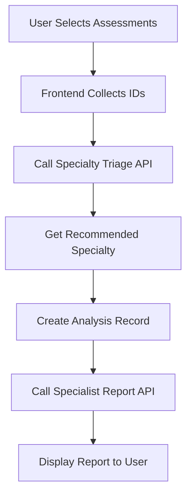

# Frontend Implementation Guide: Specialist Reports

## Complete Frontend Flow



## Step-by-Step Implementation

### Step 1: User Selects Assessments

Frontend shows checkboxes/list of:
- Quick Scans
- Deep Dives  
- General Assessments
- General Deep Dives
- Photo Sessions

User selects which ones to include in report.

### Step 2: Determine Which Specialist

**API Call:**
```javascript
const triageResponse = await fetch('/api/report/specialty-triage', {
  method: 'POST',
  headers: { 'Content-Type': 'application/json' },
  body: JSON.stringify({
    user_id: currentUserId,
    quick_scan_ids: selectedQuickScans,    // Array of IDs
    deep_dive_ids: selectedDeepDives,      // Array of IDs
    general_assessment_ids: selectedGeneral, // Array of IDs
    general_deep_dive_ids: selectedGeneralDives, // Array of IDs
    photo_session_ids: selectedPhotos      // Array of IDs
  })
});
```

**Response You Get:**
```json
{
  "status": "success",
  "triage_result": {
    "primary_specialty": "cardiology",  // THIS TELLS YOU WHICH ENDPOINT TO USE
    "confidence": 0.85,
    "reasoning": "Patient presents with chest pain, shortness of breath...",
    "secondary_specialties": [
      {
        "specialty": "pulmonology",
        "confidence": 0.45,
        "reason": "Dyspnea could have pulmonary component"
      }
    ],
    "urgency": "urgent",
    "red_flags": ["chest pain with exertion", "new onset symptoms"],
    "recommended_report_type": "cardiology"
  },
  "generated_at": "2025-01-22T10:30:00Z"
}
```

### Step 3: Create Analysis Record

**API Call:**
```javascript
// Create analysis record in your database
const analysisId = generateUUID();
await supabase.from('report_analyses').insert({
  id: analysisId,
  user_id: currentUserId,
  created_at: new Date().toISOString(),
  purpose: 'Specialist report generation',
  recommended_type: triageResponse.triage_result.primary_specialty,
  confidence: triageResponse.triage_result.confidence,
  report_config: {
    time_range: {
      start: startDate,  // Optional
      end: endDate       // Optional
    }
  },
  quick_scan_ids: selectedQuickScans,
  deep_dive_ids: selectedDeepDives
});
```

### Step 4: Generate Specialist Report

Based on `primary_specialty` from triage, call the appropriate endpoint:

#### Endpoint Mapping:
```javascript
const specialtyEndpoints = {
  'cardiology': '/api/report/cardiology',
  'neurology': '/api/report/neurology',
  'psychiatry': '/api/report/psychiatry',
  'dermatology': '/api/report/dermatology',
  'gastroenterology': '/api/report/gastroenterology',
  'endocrinology': '/api/report/endocrinology',
  'pulmonology': '/api/report/pulmonology',
  'primary-care': '/api/report/primary-care',
  'orthopedics': '/api/report/orthopedics',
  'rheumatology': '/api/report/rheumatology',
  'urology': '/api/report/specialist',  // Generic
  'infectious-disease': '/api/report/specialist'  // Generic
};

const endpoint = specialtyEndpoints[triageResponse.triage_result.primary_specialty] 
                 || '/api/report/specialist';  // Fallback to generic
```

**API Call:**
```javascript
const reportResponse = await fetch(endpoint, {
  method: 'POST',
  headers: { 'Content-Type': 'application/json' },
  body: JSON.stringify({
    analysis_id: analysisId,
    user_id: currentUserId,
    quick_scan_ids: selectedQuickScans,
    deep_dive_ids: selectedDeepDives,
    general_assessment_ids: selectedGeneral,
    general_deep_dive_ids: selectedGeneralDives,
    photo_session_ids: selectedPhotos
  })
});
```

**Response You Get (All Endpoints Return Same Structure):**
```json
{
  "report_id": "uuid-here",
  "report_type": "cardiology",
  "status": "success",
  "generated_at": "2025-01-22T10:35:00Z",
  "report_data": {
    "executive_summary": {
      "one_page_summary": "68-year-old male with progressive exertional chest pain...",
      "key_findings": [
        "Typical angina pattern with CCS Class II symptoms",
        "Cardiovascular risk factors: hypertension, dyslipidemia"
      ],
      "patterns_identified": ["Morning symptoms", "Cold weather trigger"],
      "chief_complaints": ["chest pressure", "dyspnea on exertion"],
      "action_items": [
        "Urgent: Cardiac stress test recommended",
        "Initiate antiplatelet therapy",
        "Continue incomplete deep dive assessment"  // If any incomplete
      ],
      "specialist_focus": "cardiology",
      "target_audience": "cardiologist"
    },
    
    "clinical_summary": {
      "chief_complaint": "Chest pressure with exertion for 3 weeks",
      "hpi": "Patient reports substernal chest pressure...",
      "symptom_timeline": [
        {
          "date": "2025-01-01",
          "symptoms": "chest pressure",
          "severity": 6,
          "context": "walking uphill",
          "duration": "5 minutes",
          "resolution": "rest"
        }
      ],
      "pattern_analysis": {
        "frequency": "daily with exertion",
        "triggers": ["exertion", "cold weather"],
        "alleviating_factors": ["rest", "nitroglycerin"],
        "progression": "worsening over 3 weeks"
      }
    },
    
    // SPECIALTY-SPECIFIC SECTION (name varies by specialty)
    "cardiology_assessment": {  // or "neurology_assessment", "psychiatry_assessment", etc.
      "angina_classification": {
        "ccs_class": "II",
        "typical_features": ["substernal", "exertional"]
      },
      "functional_capacity": {
        "current": "4-6 METs",
        "baseline": "8-10 METs"
      },
      "calculated_scores": {
        "cha2ds2_vasc": {
          "score": 3,
          "confidence": 0.85,
          "components": { /* ... */ }
        }
      }
    },
    
    "diagnostic_priorities": {
      "immediate": ["ECG", "Troponin", "Stress test"],
      "short_term": ["Echo", "Coronary CTA"],
      "long_term": ["Lipid optimization"]
    },
    
    "treatment_recommendations": {
      "lifestyle": ["Cardiac rehabilitation", "Low sodium diet"],
      "medical": ["Aspirin 81mg daily", "Statin therapy"],
      "follow_up": ["Cardiology within 1 week"]
    },
    
    "follow_up_plan": {
      "timeline": "1 week",
      "next_steps": ["Complete stress test", "Finish incomplete assessments"],
      "monitoring": ["Daily symptom diary", "BP monitoring"]
    }
  },
  "specialty": "cardiology",
  "confidence_score": 82,
  "model_used": "deepseek/deepseek-chat"
}
```

### Step 5: Display Report

```javascript
// Parse the response
const report = reportResponse.report_data;

// Display sections
showExecutiveSummary(report.executive_summary);
showClinicalDetails(report.clinical_summary);
showSpecialtyAssessment(report[`${specialty}_assessment`]);
showDiagnosticPlan(report.diagnostic_priorities);
showTreatmentPlan(report.treatment_recommendations);
showFollowUp(report.follow_up_plan);

// Highlight action items
if (report.executive_summary.action_items.some(item => 
    item.includes('Continue') || item.includes('incomplete'))) {
  showIncompleteAssessmentWarning();
}
```

---

## Quick Reference: What Each Endpoint Returns

### All Endpoints Return:
- `report_id`: Unique identifier
- `status`: "success" or "error"
- `report_type`: The specialty type
- `generated_at`: Timestamp
- `report_data`: Object with these sections:
  - `executive_summary`: One-page overview
  - `clinical_summary`: Detailed symptoms
  - `[specialty]_assessment`: Specialty-specific findings
  - `diagnostic_priorities`: Tests needed
  - `treatment_recommendations`: Treatment plan
  - `follow_up_plan`: Next steps

### Specialty-Specific Sections:

| Specialty | Assessment Section Name | Unique Features |
|-----------|------------------------|-----------------|
| Cardiology | `cardiology_assessment` | CHA₂DS₂-VASc, NYHA class, CCS grade |
| Neurology | `neurology_assessment` | NIH stroke scale, ABCD² score, headache patterns |
| Psychiatry | `psychiatry_assessment` | PHQ-9, GAD-7, mood assessment |
| Dermatology | `dermatology_assessment` | ABCDE criteria, photo progression |
| Gastroenterology | `gastroenterology_assessment` | Rome IV criteria, Bristol stool chart |
| Endocrinology | `endocrinology_assessment` | Diabetes risk, thyroid assessment |
| Pulmonology | `pulmonology_assessment` | mMRC dyspnea scale, CAT score |
| Primary Care | `primary_care_assessment` | Preventive gaps, multi-system review |
| Orthopedics | `orthopedics_assessment` | Range of motion, functional scores |
| Rheumatology | `rheumatology_assessment` | DAS28, morning stiffness |

---

## Error Handling

```javascript
try {
  const triageResponse = await fetch('/api/report/specialty-triage', {...});
  
  if (!triageResponse.ok) {
    throw new Error('Triage failed');
  }
  
  const triage = await triageResponse.json();
  
  if (triage.status === 'error') {
    handleError(triage.error);
    return;
  }
  
  // Continue with report generation...
  
} catch (error) {
  console.error('Report generation failed:', error);
  showUserError('Unable to generate report. Please try again.');
}
```

---

## Complete Working Example

```javascript
async function generateSpecialistReport(selectedAssessments) {
  try {
    // Step 1: Triage to determine specialty
    const triageResponse = await fetch('/api/report/specialty-triage', {
      method: 'POST',
      headers: { 'Content-Type': 'application/json' },
      body: JSON.stringify({
        user_id: currentUser.id,
        quick_scan_ids: selectedAssessments.quickScans,
        deep_dive_ids: selectedAssessments.deepDives
      })
    });
    
    const triage = await triageResponse.json();
    const specialty = triage.triage_result.primary_specialty;
    
    // Step 2: Create analysis record
    const analysisId = crypto.randomUUID();
    await supabase.from('report_analyses').insert({
      id: analysisId,
      user_id: currentUser.id,
      created_at: new Date().toISOString(),
      recommended_type: specialty,
      confidence: triage.triage_result.confidence,
      report_config: {}
    });
    
    // Step 3: Generate specialist report
    const endpoint = `/api/report/${specialty}`;
    const reportResponse = await fetch(endpoint, {
      method: 'POST',
      headers: { 'Content-Type': 'application/json' },
      body: JSON.stringify({
        analysis_id: analysisId,
        user_id: currentUser.id,
        quick_scan_ids: selectedAssessments.quickScans,
        deep_dive_ids: selectedAssessments.deepDives
      })
    });
    
    const report = await reportResponse.json();
    
    // Step 4: Display report
    displayReport(report);
    
    // Step 5: Check for incomplete assessments
    const hasIncomplete = report.report_data.executive_summary.action_items
      .some(item => item.includes('Continue') || item.includes('incomplete'));
    
    if (hasIncomplete) {
      showContinueAssessmentButton();
    }
    
    return report;
    
  } catch (error) {
    console.error('Failed to generate report:', error);
    showError('Unable to generate specialist report');
  }
}
```

---

## Key Points for Frontend:

1. **Always call triage first** to determine which specialist endpoint to use
2. **Create analysis record** before generating report (required)
3. **Use the specialty-specific endpoint** based on triage result
4. **All endpoints return the same structure** - just different specialty assessments
5. **Check action_items** for "Continue Assessment" to know if sessions are incomplete
6. **Incomplete sessions are included** - no need to filter them out

---

## Testing in Frontend:

```javascript
// Test IDs from your examples
const testUser1 = {
  userId: "45b61b67-175d-48a0-aca6-d0be57609383",
  deepDiveId: "057447a9-3369-42b2-b683-778d10ae5c8b"  // analysis_ready status
};

const testUser2 = {
  userId: "323ce656-8d89-46ac-bea1-a6382cc86ce9",
  quickScanId: "01398d26-9974-482e-867a-5e840ca67679"  // high urgency
};
```